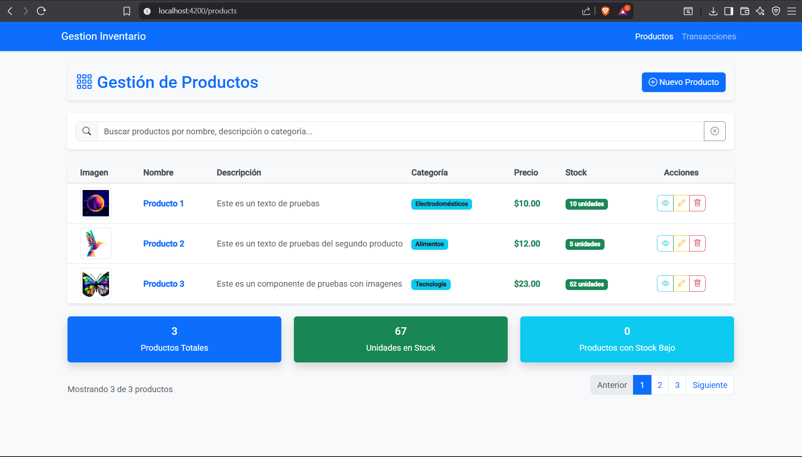
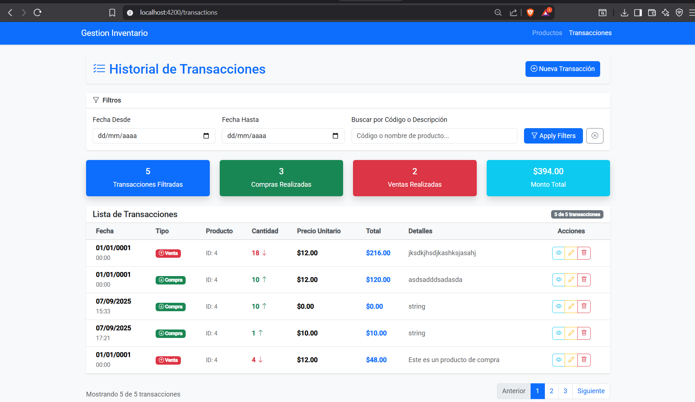
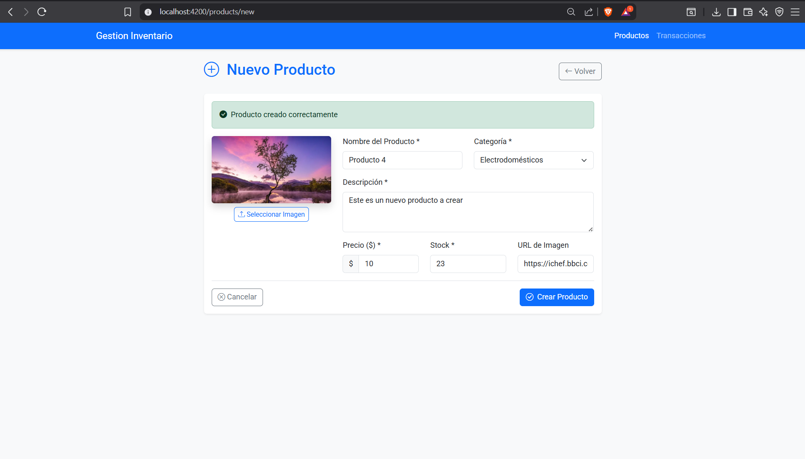
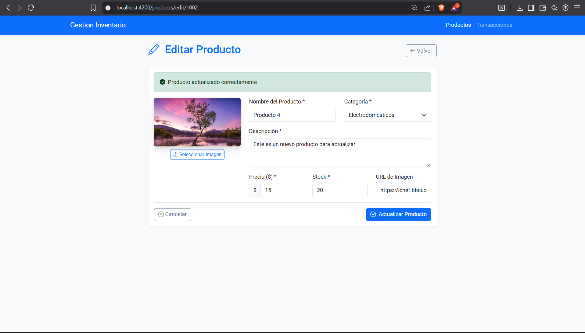
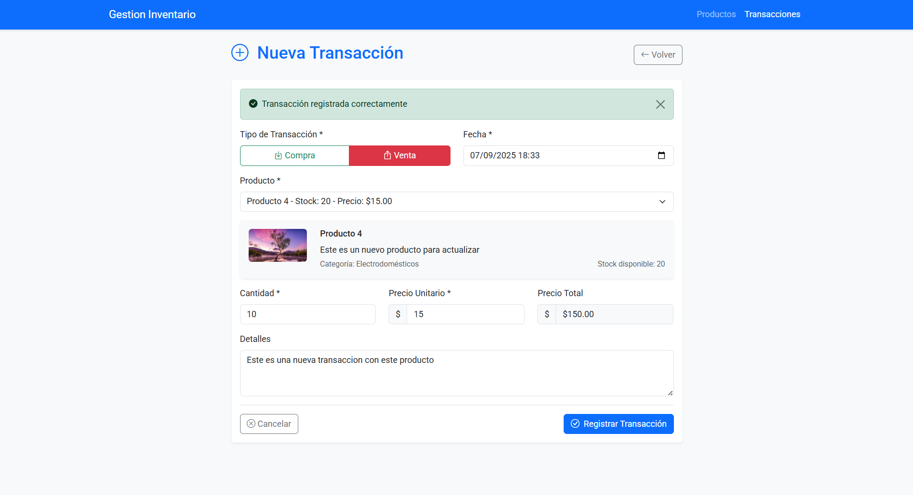
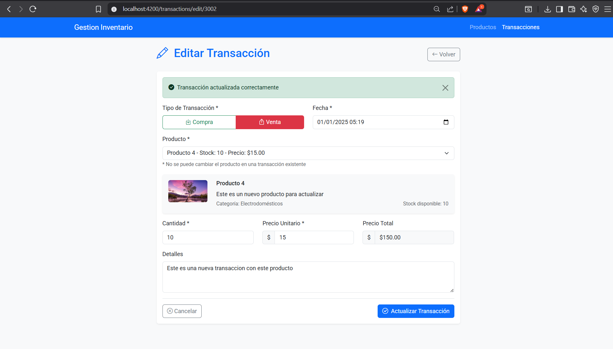
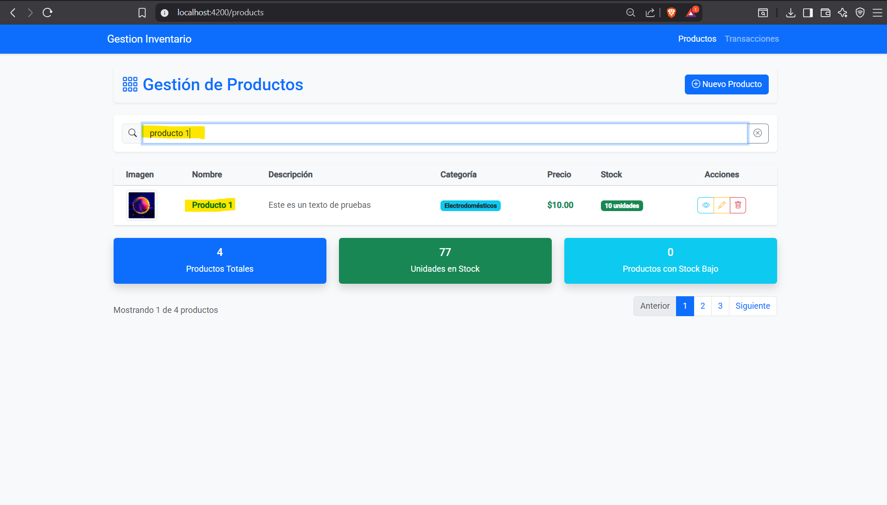
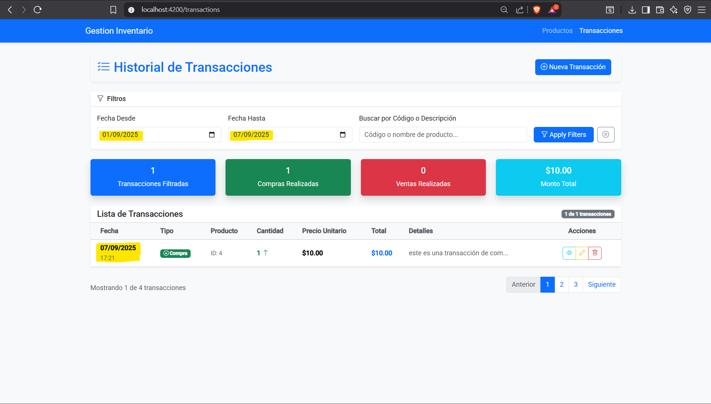
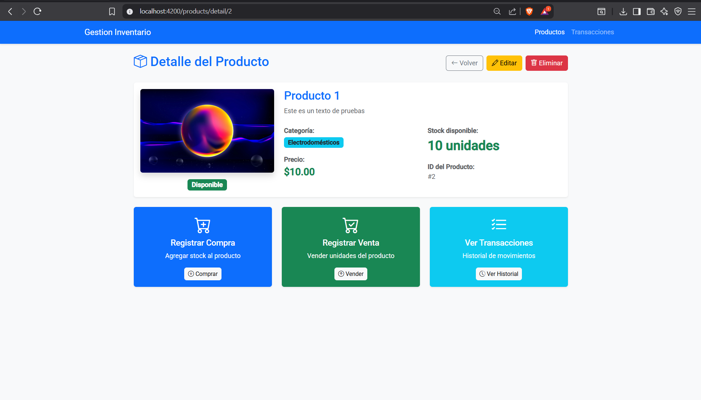
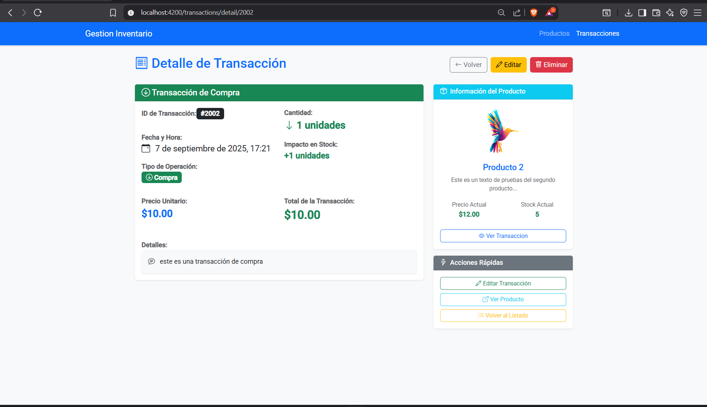

# 📦 Gestión de Productos y Transacciones

Este proyecto implementa un sistema de **gestión de productos y transacciones** compuesto por:  
- **Dos microservicios** en `.NET Web API` (productos y transacciones).  
- **Un frontend** en `Angular 22` para la interfaz de usuario.  
- **Orquestación con Docker Compose** para levantar todo en un solo comando.  

---

## 🚀 Requisitos

Antes de ejecutar el proyecto, asegúrate de tener instalado:

- [Node.js 20+](https://nodejs.org/) y [npm](https://www.npmjs.com/)  
- [Angular CLI 22+](https://angular.dev/)  
- [.NET 7 SDK o superior](https://dotnet.microsoft.com/download)  
- [Docker Desktop](https://www.docker.com/products/docker-desktop/)  
- [Git](https://git-scm.com/)  

---

## ⚙️ Ejecución del Backend

1. Clonar el repositorio:

   ```bash
   git clone https://github.com/Cecy1402/GestionInventario.git
   cd tu-repo
   ```

2. Acceder a cada microservicio `GestionDeProducto` y `RegistroDeTransacciones` donde se encuentra el archivo `docker-compose.yml`.

3. Levantar los microservicios:

   ```bash
   docker-compose up --build
   ```

4. Una vez levantados, estarán disponibles en:  
   - **Productos API:** http://localhost:5000/swagger/index.html 
   - **Transacciones API:** http://localhost:5001/swagger/index.html

> 📌 Cada microservicio tiene su propio `Dockerfile` configurado dentro de su carpeta.

---

## 🖥️ Ejecución del Frontend

1. Acceder a la carpeta del frontend:

   ```bash
   cd frontend
   ```

2. Instalar dependencias:

   ```bash
   npm install
   ```

3. Levantar el servidor de desarrollo:

   ```bash
   ng serve -o
   ```

4. La aplicación quedará disponible en:  
   👉 http://localhost:4200  

---

## 📸 Evidencias

A continuación, se muestran capturas de pantalla de la aplicación en funcionamiento:

1. **Listado dinámico de productos y transacciones con paginación**  
   

   

2. **Pantalla para la creación de productos**  
   

3. **Pantalla para la edición de productos**  
   

4. **Pantalla para la creación de transacciones**  
   

5. **Pantalla para la edición de transacciones**  
   

6. **Pantalla de filtros dinámicos**  
   
   

7. **Pantalla para la consulta de información de un formulario (extra)**  
   

   

---

## 📂 Estructura del Repositorio

```bash
├── backend/
│   ├── GestionDeProducto/
│   │   └── Dockerfile
│   ├── RegistroDeTransacciones/
│   │   └── Dockerfile 
├── frontend/
│   └── GestionInventario-Front/
│       ├── src/
│       └── package.json
└── images/
```

---

## 👨‍💻 Autores

- **Carmen Narváez** - Desarrollador Fullstack  
- Proyecto para la gestión de inventarios.  
